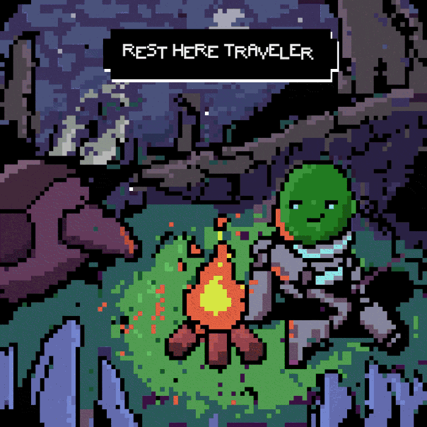
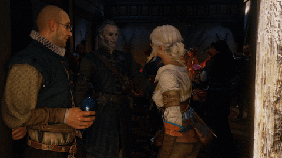
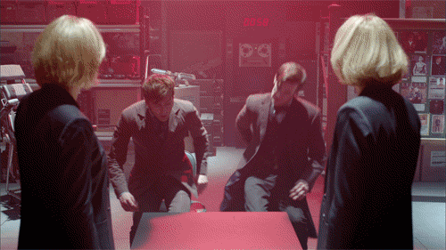

  

  

<h3 align="center">Welcome to Cassio's GitHub :smiley:</h3>

Hi, my name is Cássio Venâncio de Souza, I'm 19 years old and I'm currently studying C++. I already have experience with some mini projects that you can access in this profile. I have experience and skill with HTML5, CSS3, basic JavaScript and Figma. I started programming at the age of 14 when I built game servers for fun, it was like that until I make 16, then I decided to stop for a while. I return to programming at the age of 18 to raise my skills and competences to a professional level.

<h3 align="center">Languages and Tools</h3>

     

<h2 align="center">:books:Learning </h2>

C++

<h2 align="center">:email:Contact</h2>

cassiocontatoprof@gmail.com

<h2 align="center">:city_sunrise:Projects</h2>

Available at Repositories

<h2 align="center">:video_game:Games</h2>

The Witcher 3, Grand Theft Auto San Andreas/V, Resident Evil VII and Red Dead Redemption

  

<h2 align="center">📺 Favorite TV Shows</h2>

 The Office, Doctor Who, The Last Of Us, Friends and How I met your mother

  

  

  

